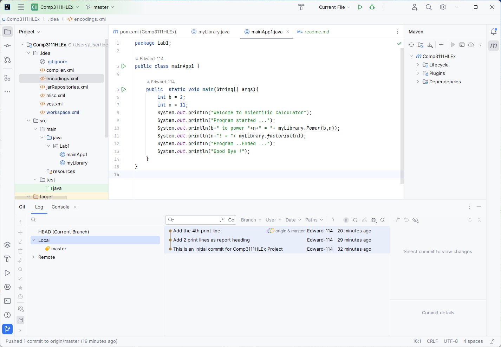

# 
**COMP3111H Lab 1** 
## **Summary** 

### 1. Build a Java Project using IntelliJ
### 2. Learnt about some git operations
### 3. Created a GitHub account and use it to keep track of changes in the remote repository
###
### Here's the screenshot of my  1st lab project in IntelliJ:

 

